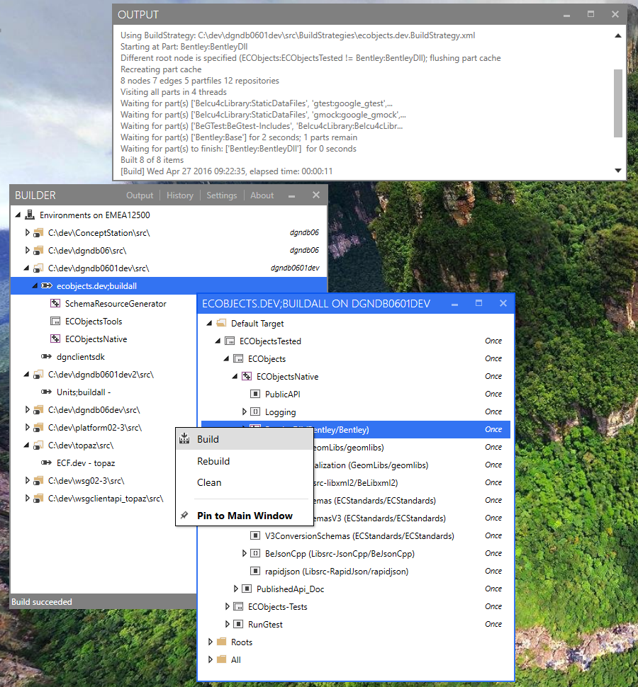

Builder Readme
==============

Introduction
------------

I mostly wrote this for myself both as a programming practice and as a tool that I will use myself on a daily basis.
Because of that, it is tailored to my personal needs, it is by no means a comprehensive UI that will cover 100% of what our build system can do.

The primary focus is on **building** stuff. For source control there is Tortoise hg.
There are a few handy source control features baked into the tool, like triggering a pull, bootstrap, or displaying incoming changes.

**This Application requires .NET Framework 4.6.1 to run.** You can download it [here](https://www.microsoft.com/en-us/download/details.aspx?id=49981) for Windows 7 and later.

Main Window
-----------

The main window tries to resemble a VisualStudio Solution Explorer as much as possible.

It shows a hierarchical tree of the environments of the current machine, the layout is as follows:

    Environments on <Machine>
    +---<source dir>                 <Stream name>
        +---<configuration>
        |   \---<Part>
        \---<configuration>
            +---<Part>
            \---<Part>

A **source dir** is a folder on the machine which contains a bootstrapped stream of source code.

Below you can have multiple **configurations** which define an output folder (multiple might point to the same), a BuildStrategy and a few additional flags. These are the nodes where you can trigger a TMR, Clean the out dir etc.

Below there are currently only parts. WIP.

FAQ
---

### Why it requires Administrator permissions

Our builds require the permission to create symbolic links.
There is two ways to make this work, I decided to just always run this application as administrator.

> The (worse) alternative would require two steps: Allowing all users to create symbolic links in gpedit.msc, and also turning off UAC. [Reference](https://stackoverflow.com/questions/15320550/why-is-secreatesymboliclinkprivilege-ignored-on-windows-8)

If your build fails due to failing permissions to create symbolic links, it will show **A required privilege is not held by the client.**

Version History
---------------

### Upcoming Features

**Short term**

-   **History** Window displaying Jobs of current session, jump to logfile by double-clicking a row
-   **About-Window** that displays available updates and installed software

**Long term**

-   Part Browser, allow pinning specific parts below a configuration node in the tree so only that part may be build
-   Extract **Warnings and Errors** for each build, write to DB
-   Visual Studio-like **Error List** Window
-   Visual Studio-like **Output** Window

### Changelog

**1.0 Initial Release Latest additions**

-   resolve automatic TCC path on demand instead of scanning on every launch
-   call python in unbuffered mode (sometimes all outputs were sent at the end of the build)

