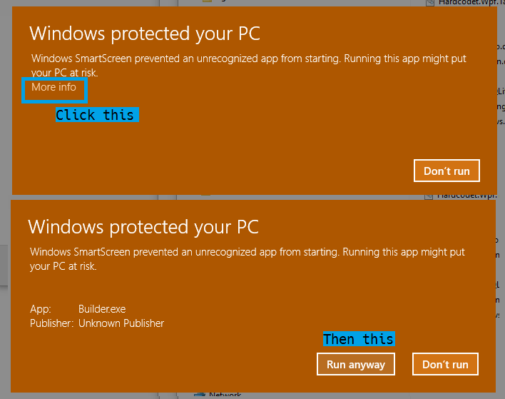

Builder
=======

Introduction
------------

I mostly wrote this for myself both as a programming practice and as a tool that I will use myself on a daily basis.
For people not working for my company, this tool will be pretty pointless, but you can still have a look at the code.

Requirements
------------

**This Application requires .NET Framework 4.6.1 to run.** You can download it [here](https://www.microsoft.com/en-us/download/details.aspx?id=49981) for Windows 7 and later.

**The Application requires administrator privileges to run** See [FAQ](Builder/doc/Readme.md#faq) for details. Basically, it's required for creating symbolic links during the builds.

When you launch this App **for the first time**, Windows does everything in its power to prevent you from doing so. SmartScreen will warn you because it does not recognize the App. I'm afraid there is not much I can do about that. It will go away once enough unique machines ran the App, which might never happen :-)

Dependencies
------------

-   [RSCoreLib](https://github.com/rschili/RSCoreLib) Personal Core Library of mine for utility features

External Dependencies
---------------------

-   [Hardcodet.Wpf.TaskbarNotification](https://bitbucket.org/hardcodet/notifyicon-wpf/) (CPOL)
-   [log4net](https://logging.apache.org/log4net/) (Apache License)
-   [mah metro](https://github.com/MahApps/MahApps.Metro) (Ms-PL)
-   [Newtonsoft.Json](https://github.com/JamesNK/Newtonsoft.Json) (MIT License)
-   [System.Data.Sqlite](https://system.data.sqlite.org/) (Ms-PL)
-   [System.Threading.Tasks.Dataflow](https://www.nuget.org/packages/System.Threading.Tasks.Dataflow) (.NET Library License)
-   [Fatcow Icon Library](http://www.fatcow.com/free-icons) (Creative Commons Attribution 3.0 License)
-   [Visual Studio Image Library](https://www.microsoft.com/en-us/download/details.aspx?id=35825) (MSLT)

User documentation
------------------

[Documentation](Builder/doc/Readme.md)
